# Lab 6: Ingest and Analysis the Real-time data (Optional)

Real-Time Clickstream Anomaly Detection using Amazon Kinesis and Amazon Kinesis Data Analytics.

## [Real-Time Clickstream Anomaly Detection Kinesis Analytics - Prelab setup](https://aws-dataengineering-day.workshop.aws/300/310-pre-lab.html#real-time-clickstream-anomaly-detection-kinesis-analytics---prelab-setup)

## [Set up the Amazon Kinesis Data Generator](https://aws-dataengineering-day.workshop.aws/300/310-pre-lab.html#set-up-the-amazon-kinesis-data-generator)
1.	Create a EC2 Windows instance to access the Amazon Kinesis Data Generator
    -	AMI: Microsoft Windows Server 2019 Base
    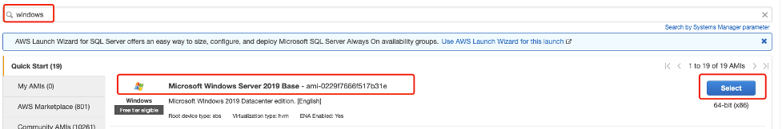
    -	Instance type: t2.large
    -	Network: default VPC; 
    -	Subnet: No Preference; 
    -	Auto-assign Public IP: Use Subnet setting (Enable)
    -	IAM Role: TeamRoleInstanceProfile
    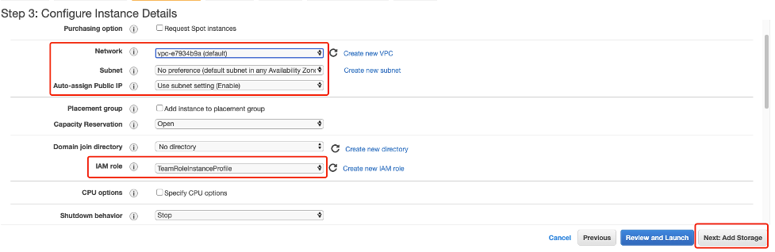
    -	Storage: Root Volume Size: 50GiB
    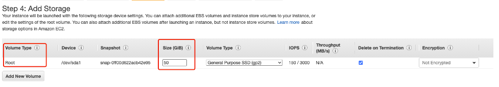
    -	Tag: Name : KinesisClient
    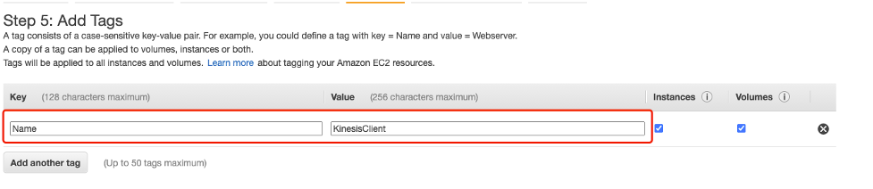
    -	Security Group: Crete new security group; Name ClientSG; Allow 3389 and 443 from 0.0.0.0/0
    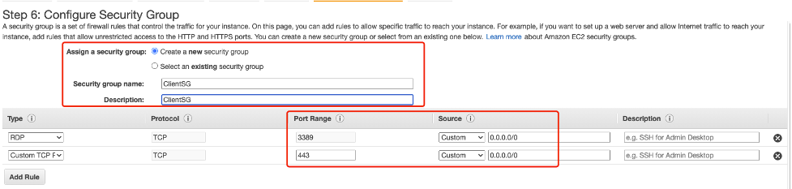
    -	Key Pair: Select the exsiting key pair Named: ee-default-keypair
    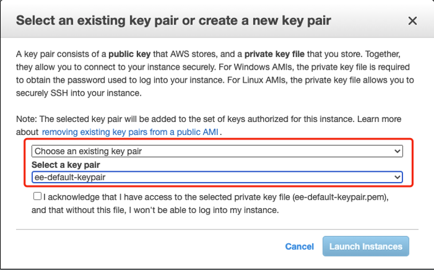
    - Wait the EC2 instance become ‘Running’ and Status Check as “2/2 check passed”
    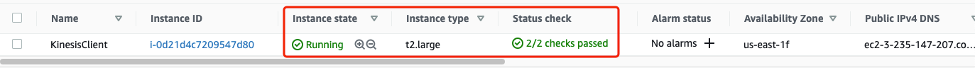

2. Go back to ‘https://dashboard.eventengine.run/dashboard’ of your eventengine account, Download the ‘SSH Key’ and Save ‘ee-default-keypair.pem’ to secured place of your desktop
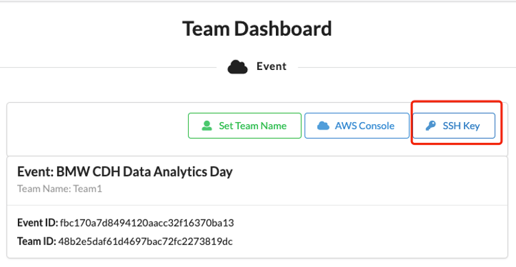

3. Get the access IP and Username/Password and connect EC2
-	Get the Public IPv4 address
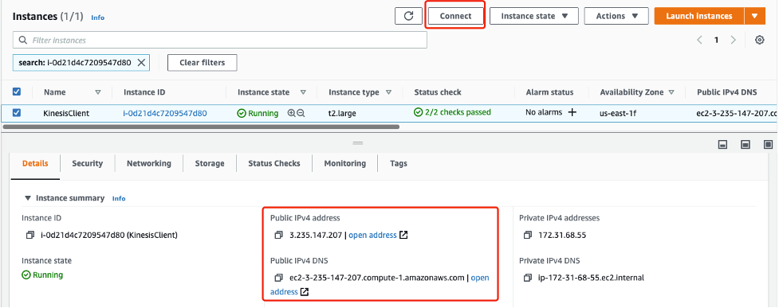
-	Click ‘Connect’ to get the Username/Password
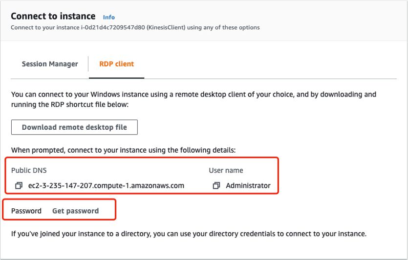
-	Browser the ‘ee-default-keypair.pem’ which saved in your desktop，then Click ‘Decrypt Password’
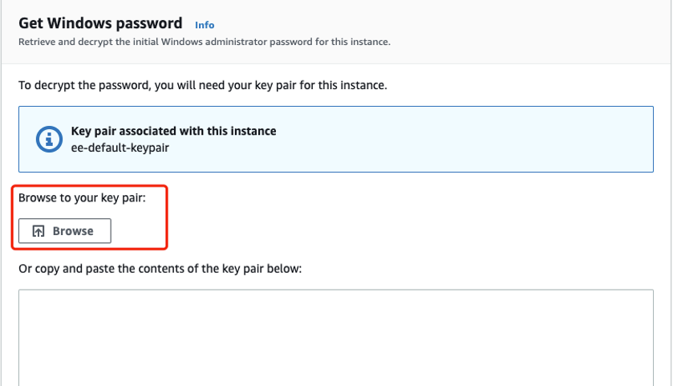
-	Save the Password for later usage
-	Use the Remote Desktop Client to login the Windows EC2 Instance
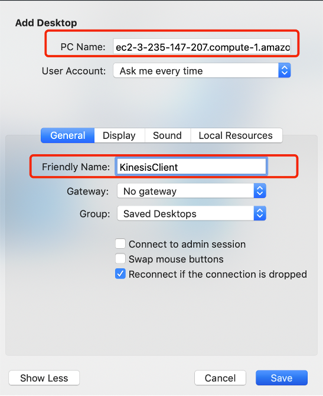

4. Open Kinesis Data Generator
-	Copy KinesisDataGeneratorUrl from CloudFormation Outputs to your Windows Server Web Browser – Suggest you install the Firefox or Chrome 
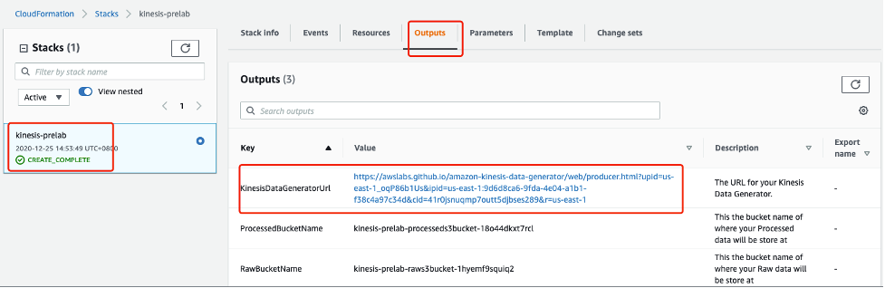
-	Then, you can continue the hands-on lab
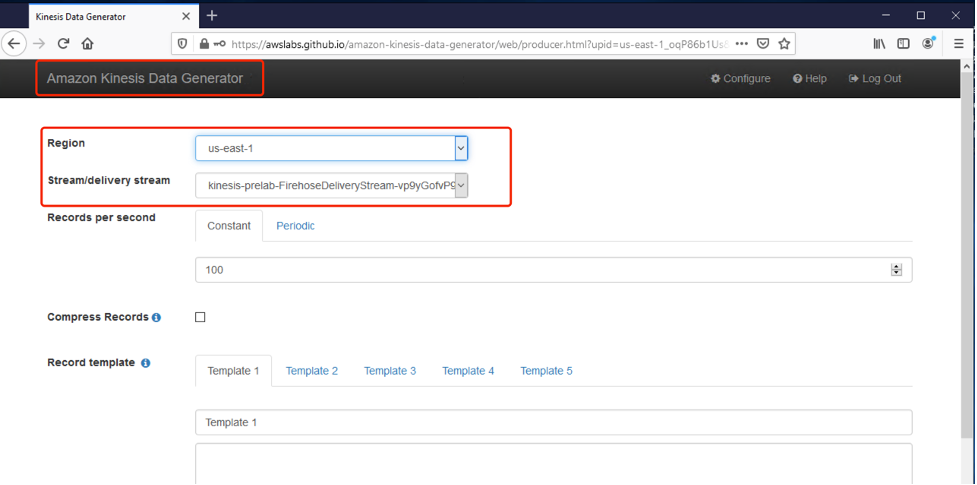

## [KINESIS MAIN LAB](https://aws-dataengineering-day.workshop.aws/300/320-main-lab.html)

## [Kinesis Data Analytics for Java Applications (Apache Flink) (Optional)](https://real-time-streaming-with-kinesis.workshop.aws/)