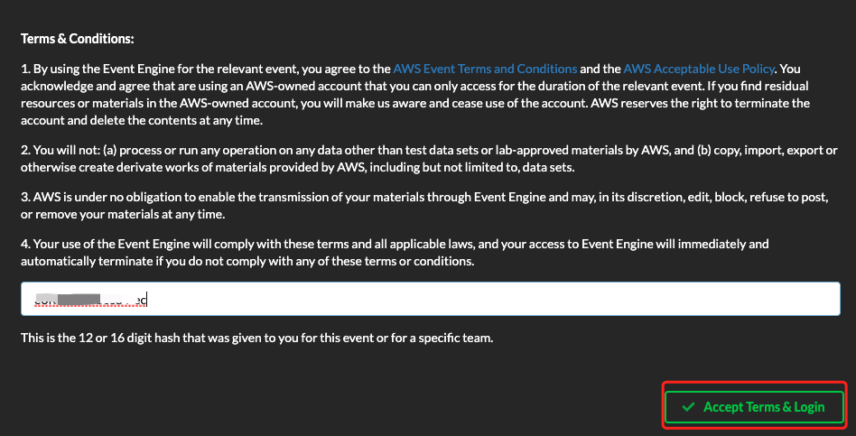
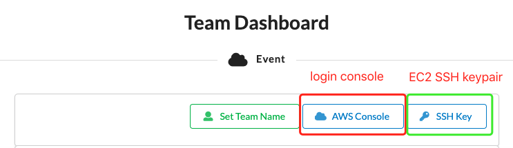
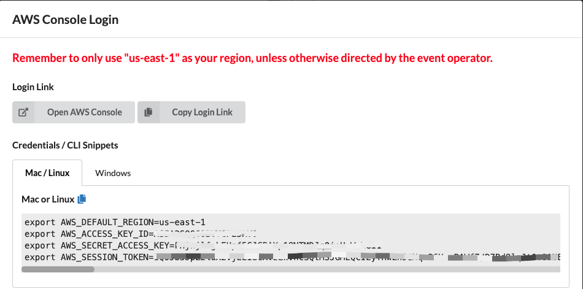

## Prepare Event Engine login

The temporary account has been being created using Event Engine. You will be provided a participant hash key to login to your temporary account.

Follow these steps to start using your account:

1. You need **the laptop with Internet Access** and an internet browser: **Mozilla Firefox or Google Chrome**.

2. Connect to the portal by clicking the button or browsing to https://dashboard.eventengine.run/ or directly login with `team-hash-login` URL

3. Enter the provided hash in the text box. Click `Accept Terms & Login` button to continue.

4. Download the `SSH Key` from the dashboard and safely store it on your laptop

5. Click on `AWS Console` on dashboard

6. Take the defaults and click on Open AWS Console. This will open AWS Console in a new browser tab.

Optional: Set the `Crendenial` as shown the windows in your laptop command line tool.

7. Once you have completed the step above, you can walk-through the workshop activities.