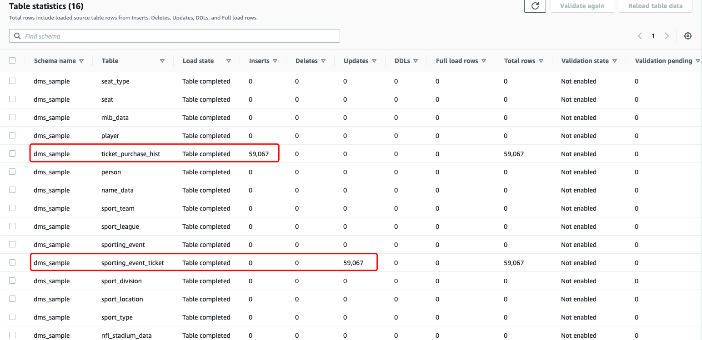

# Lab 1: Perform Data Ingestion with Data Migration Service

The Database Migration Services (DMS) hands-on lab provide a scenario, where participant learns to hydrate Amazon S3 data lake with a relation database such as PostgreSQL. 

In this lab, you will complete the following tasks using AWS CloudFormation template:

- Create the source database environment.
- Hydrate the source database environment.
- Demonstrate CDC (Change Data Capture) replication within DMS.
- Create Lambda function to trigger database update and continue replicate data to Amazon S3 using DMS.


## Session 1: DMS Quick Start and Ingest PostgreSQL data to S3
### DMS Prepare Lab1
1. [Introduction](https://aws-dataengineering-day.workshop.aws/400/410-pre-lab-1.html#introduction) 
2. [Create the Instructor Environment, including a RDS Postgres database as the data source](https://aws-dataengineering-day.workshop.aws/400/410-pre-lab-1.html#create-the-instructor-environment)

### DMS ingestion Lab
1. [Changing RDS Security Group](https://aws-dataengineering-day.workshop.aws/400/410-pre-lab-1.html#changing-rds-security-group). You only need run step1 - step4.
2. Access Database
    1. Launch a EC2 instance with `Amazon Linux 2 AMI (HVM)` / t2.micro instancetype
    2. VPC: `DMSLabSourceDB`, Subnet: `DMSLabEC2`, `Auto-assign Public IP`: Enable
    3. Create a Security group of EC2 to allow 22 port and 443 port
    4. Select Keypair
    5. Login EC2 by Click EC2 console `Connect` button, then `EC2 Instance Connect`
    ```bash
    sudo amazon-linux-extras install -y postgresql11
    psql --host=dmslabinstance.ckgu6mtqronk.us-east-1.rds.amazonaws.com --port=5432 --dbname=sportstickets --username=master
    # when promote the password, type master123
    \dt dms_sample.*
    SELECT * from dms_sample.player limit 10;
    SELECT * FROM pg_stat_user_functions WHERE funcname in ('generateticketactivity','generatetransferactivity');
    ```

    Or Using can use other SQL Client tool using JDBC URL such as SQL Workbench https://www.sql-workbench.eu/downloads.html
    ```bash
    # sample JDBC URL
    jdbc:postgresql:// dmslabinstance.cyhjolfstdii.us-east-1.rds.amazonaws.com:5432/sportstickets
    ```
3. [Setup DMS ingestion](https://aws-dataengineering-day.workshop.aws/400/420-auto-complete-lab.html)

### Check the result
1. At this point, the source data has been fully loaded from RDS database to your S3 bucket via DMS. Go to AWS DMS console, you should see two Database migration tasks are 100% completed. 


2. You can navigate to `dms-task-full-dump` task details, see “Table statistics” section


3. [Generate and Replicate the CDC Data](https://aws-dataengineering-day.workshop.aws/400/410-pre-lab-1.html#generate-and-replicate-the-cdc-data-optional).
**Note: you need `Deploy` function again once you change the SQL query in lambda function**

4. You may need to wait 2 to 5 minutes for CDC data to first reflect in your RDS postgres database and then picked up by DMS CDC migration task.

    Once the CDC Data gets replicated, you can navigate to CDC task details, see “Table statistics” section and verify it, as shown below:

    

**Note: In case you see DMS CDC task in fail/error status. Make sure your replication instance version is 3.3.1 and it is large enough (dms.t2.medium or above) to run CDC replication task**

5. Open the S3 console and view the CDC data that was copied by DMS.
- S3 bucket name can be found in CloudFormation outputs

- View the data that was copied by DMS


- Preview the content by `S3 Select` action
