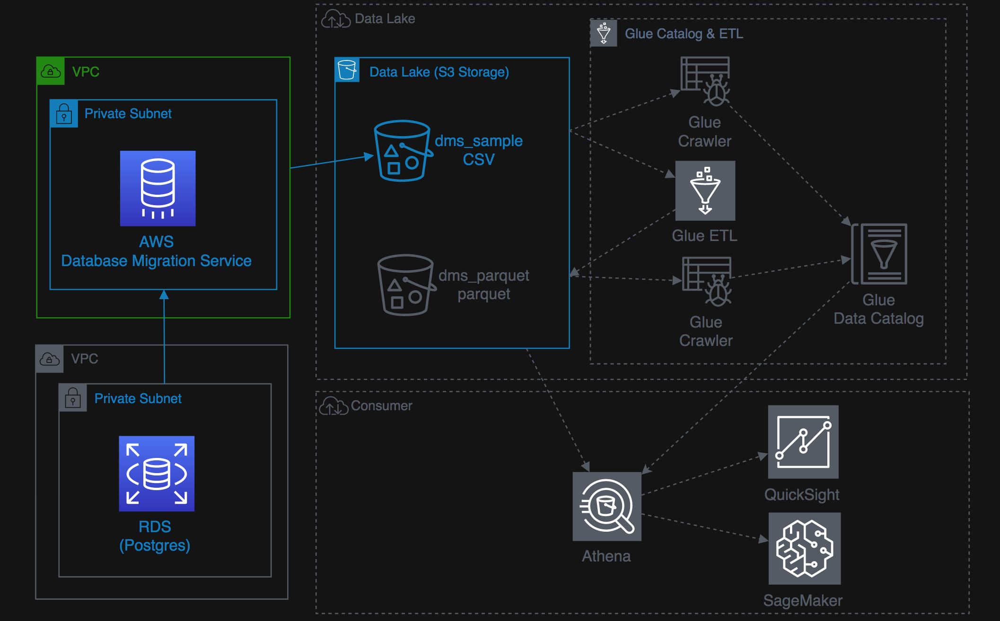

# Lab 1: Perform Data Ingestion with Data Migration Service

The Database Migration Services (DMS) hands-on lab provide a scenario, where participant learns to hydrate Amazon S3 data lake with a relation database such as PostgreSQL. 

In this lab, you will complete the following tasks using AWS CloudFormation template:

- Create the source database environment.
- Hydrate the source database environment.
- Update the source database environment to demonstrate CDC (Change Data Capture) replication within DMS.
- Create Lambda function to trigger CDC data which will be replicated to Amazon S3 by DMS CDC endpoint.



## Session 1: DMS Quick Start and 
- [Introduction](https://aws-dataengineering-day.workshop.aws/400/410-pre-lab-1.html#limit-instruction) 
- [Create the Instructor Environment, including a RDS Postgres database as the data source](https://aws-dataengineering-day.workshop.aws/400/410-pre-lab-1.html#create-the-instructor-environment)
- [Changing RDS Security Group](https://aws-dataengineering-day.workshop.aws/400/410-pre-lab-1.html#changing-rds-security-group)
- [Access Database from SQL Client (Optional)](https://aws-dataengineering-day.workshop.aws/400/410-pre-lab-1.html#access-database-from-sql-client-optional)

    You can use the PostGreSQL Client
    ```bash
    psql --host= dmslabinstance.cyhjolfstdii.us-east-1.rds.amazonaws.com --port=5432 --dbname=sportstickets --username=master
    \dt dms_sample.*
    ```

    Or SQL Client tool using JDBC URL such as SQL Workbench https://www.sql-workbench.eu/downloads.html
    ```bash
    
    jdbc:postgresql:// dmslabinstance.cyhjolfstdii.us-east-1.rds.amazonaws.com:5432/sportstickets
    ```

- [Generate and Replicate the CDC Data (Optional)](https://aws-dataengineering-day.workshop.aws/400/410-pre-lab-1.html#generate-and-replicate-the-cdc-data-optional)
- [Setup DMS ingestion](https://aws-dataengineering-day.workshop.aws/400/420-auto-complete-lab.html)

## Session 2: Advance tasks

If you prefer to get hands-on with AWS DMS service, you can delete the CloudFormation Stack in [Setup DMS ingestion](https://aws-dataengineering-day.workshop.aws/400/420-auto-complete-lab.html) and proceed with
- [Create the Student Environment](https://aws-dataengineering-day.workshop.aws/400/430-pre-lab-2.html)
- [DMS Main Lab](https://aws-dataengineering-day.workshop.aws/400/440-main-lab.html)