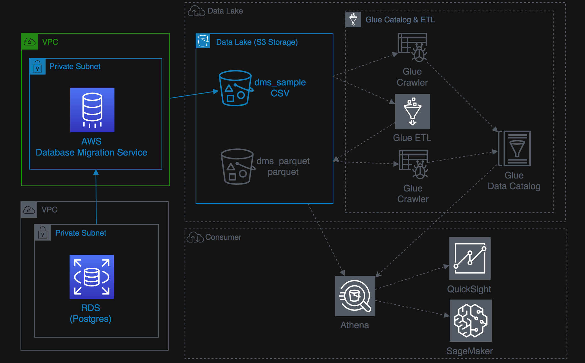
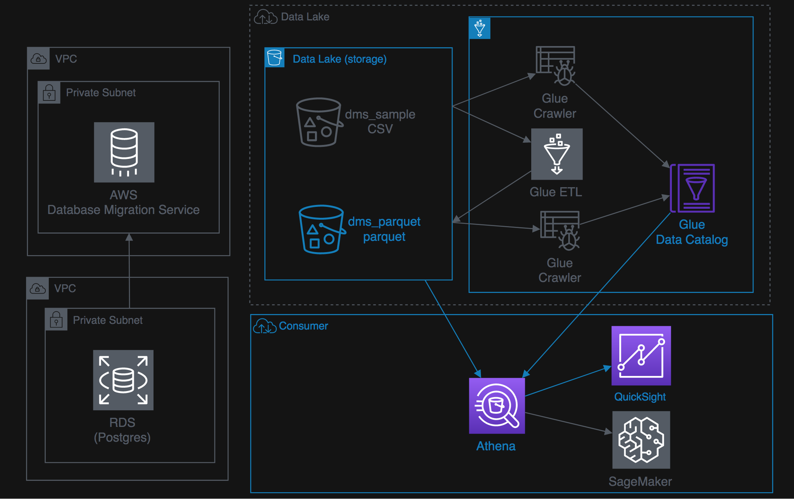
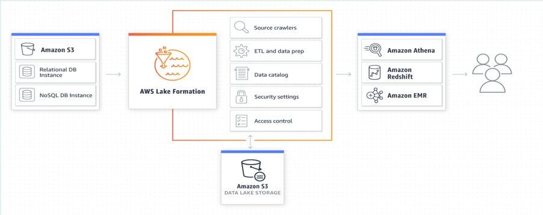
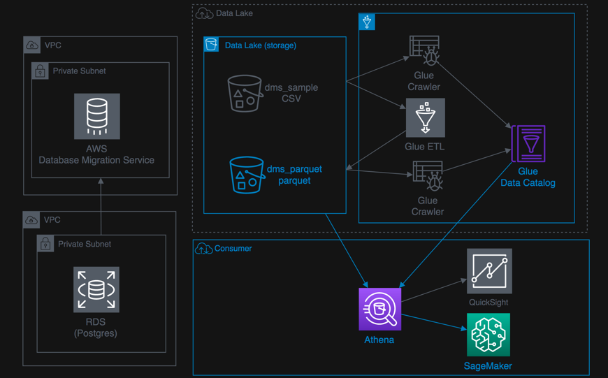

# Data-Engineering-Workshop

These labs are designed to be completed in sequence, and the full set of instructions are documented in this repository. Read and follow along to complete the labs. Our lab instructor will give you a high-level overview of the labs and help answer any questions. Don’t worry if you get stuck, we provide hints along the way.

For the hands-on part of this workshop you need **your laptop with Internet Access** and an internet browser: **Mozilla Firefox or Google Chrome**.

You are encouraged to form groups of 3-4 based on the AWS hanson experience in big data services and at least one person in your group must have a laptop to perform the tasks.

## Prepare Event Engine login
[Event-Engine-login](Event-Engine-login.md)

## Lab 1: Perform Data Ingestion with Data Migration Service
- [Ingestion-with-DMS-Basic](Ingestion-with-DMS-Basic.md)
- [(Optional) Ingestion-with-DMS Advance Task](Ingestion-with-DMS.md)

## Lab 2: Data Transformations ETL with Glue
- [Transforming-data-with-Glue-Basic](Transforming-data-with-Glue-Basic.md)
- [(Optional) Transforming-data-with-Glue (Bookmark and Workflow)](Transforming-data-with-Glue.md)

## Lab 3: Explore this DataLake using SQL and Visualization tool
- [Athena-and-QuickSight-Basic](Athena-and-QuickSight-Basic.md)
- [(Optional) Athena-and-QuickSight (Athena Workgroups)](Athena-and-QuickSight.md)

## Lab 4: Data Lake Automation with Lake Formation
[Data-Lake-Automation-with-LakeFormation](Data-Lake-Automation-with-LakeFormation.md)

## Lab 5: Do AI-ML workload using-Sagemaker (Optional)
[AI-ML-using-Sagemaker](AI-ML-using-Sagemaker.md)

## Lab 6: Ingest and Analysis the Real-time data (Optional)
[Clickstream Anomaly Detection](Clickstream-Anomaly-Detection.md)
